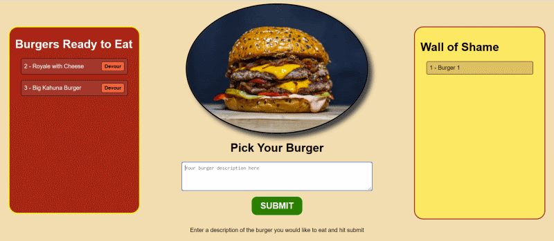

# express-handlebars
A logging app using Node, Express, Handlebars, MySQL  
This project is an example of server side rendering.
* Dynamically renders pages using Handlebars
* Serves content using express 
* Tracks data with MySQL database
* No client-side scripts

## Live Site
[Burger App @ Heroku](https://express-burger-app.herokuapp.com/)
